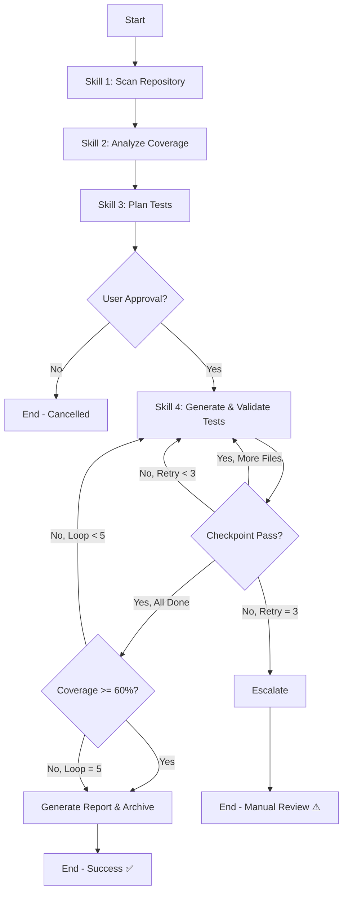

# 🎯 AI-Driven Unit Test Coverage & Generation System

[](https://opensource.org/licenses/MIT)
[](https://dotnet.microsoft.com/)
[](https://github.com/features/copilot)

> **Interactive, AI-driven unit test coverage assessment & generation with 4-metric coverage analysis, intelligent retry, and strict escalation policies.**

---

## ⚠️ **FOR AI AGENTS (GitHub Copilot, etc.)**

**🚨 DO NOT READ THIS README FOR EXECUTION!**

This README is **documentation for human users**. If you are an AI agent executing unit test generation:

### **MANDATORY RULES**:

1. ✅ **Read `.github/skills/` directory ONLY** - Never use README for execution data
2. ✅ **Follow skill sequence automatically** when user requests "generate unit tests":
   - Step 1: `scan-repository/SKILL.md` (exhaustive file discovery + type registry)
   - Step 2: `analyze-coverage/SKILL.md` (Coverlet XML, baseline locking)
   - Step 3: `plan-tests/SKILL.md` (risk-based prioritization, user approval)
   - Step 4: `generate-and-validate-tests/SKILL.md` (file-by-file, 25-test checkpoints, coverage loop, **integrated reporting**)
3. ❌ **NEVER use example figures from README** (examples are for documentation, not current data)
4. ❌ **NEVER estimate coverage** - Use ONLY Coverlet XML actual values
5. ❌ **NEVER skip baseline locking** - Must create `TestResults/BASELINE/baseline.xml`
6. ✅ **Execute each skill step-by-step** - Read SKILL.md line-by-line, execute all steps
7. ✅ **Unless user specifies specific task** - Default sequence is Steps 1-4

**If you read this README instead of skills/**: You are doing it wrong. Stop and start over.

---

## 📋 Table of Contents
- [Overview](#%F0%9F%8C%9F-overview)
- [Features](#%E2%9C%A8-features)
- [Coverage Metrics](#%F0%9F%93%8F-coverage-metrics)
- [Installation](#%F0%9F%93%A6-installation)
- [Usage](#%F0%9F%9A%80-usage)
- [Workflow](#%F0%9F%94%84-workflow)
- [Skills Reference](#%F0%9F%93%9A-skills-reference)
- [Troubleshooting](#%F0%9F%90%9B-troubleshooting)
- [Version History](#%F0%9F%93%8C-version-history)

---

## 🌟 Overview

This **skill set** provides a **comprehensive unit test generation system** implemented as GitHub Copilot Agent Skills. Designed for .NET/C# projects (Azure Functions, Web APIs, Class Libraries), it automates the complete test generation lifecycle with **strict quality gates** and **intelligent error handling**.

### Why Agent Skills?
- ✅ **Multi-skill orchestration** - Chain multiple skills to execute complex, multi-step workflows
- ✅ **Script and template support** - Include scripts and define consistent output formats
- ✅ **On-demand loading** - Skills indexed by keywords, activated when needed
- ✅ **Team reusable** - Share across projects and teams
- ✅ **No installation required** - Works out-of-the-box with GitHub Copilot


## ✨ Features

### 🎯 Key Capabilities
- **4 Coverage Metrics**: Line, Branch, Method, **Full Method Coverage**
- **Priority-Based Generation**: Critical → High → Medium → Low (risk analysis)
- **File-by-File Strategy**: Complete one file at a time (eliminates cross-file confusion)
- **25-Test Checkpoints**: Validate every 25 tests (compile + test immediately)
- **Coverage Loop**: Auto-continues until 60% target (max 5 iterations)
  - Coverage checked after each file completes (early stopping if target met)
  - Fills gaps from estimation errors
- **Single Approval**: User approves test plan once, then auto-executes

### 🔍 Comprehensive Analysis
- Repository structure detection (.NET 6/7/8, Azure Functions, ASP.NET Core)
- **Type Discovery**: Pre-scans exact constructors before generation
- **Testability Filtering**: Auto-skips 15+ non-testable patterns (Azure Functions, Controllers, Models, Static Helpers)
- **Baseline Locking**: Coverage locked at Step 2 for accurate comparison
- Edge case detection (null handling, boundaries, exceptions, async/cancellation)
- Risk-based prioritization scoring

### 🧪 Test Generation
- **AAA Pattern** (Arrange-Act-Assert) enforcement
- **Mocking best practices** (Moq, NSubstitute, FakeItEasy)
- **Fluent assertions** for readable tests
- **AutoFixture** for data generation
- **Azure Functions** specific patterns (ILogger, ExecutionContext)

### 🔄 Intelligent Retry & Escalation
- **Error fingerprinting** (SHA256 hash) detects repeated failures
- **Automatic fixes** for common issues (missing usings, async/await, mock setup)
- **Escalation criteria**: Max 3 attempts per checkpoint
- **State Management**: Recovery from crashes, resume from checkpoints

### 📊 Reporting & Archive
- Before/after coverage comparison (all 4 metrics)
- Tests generated breakdown (by file, category, quality)
- Edge cases covered summary
- Actionable recommendations
- **Permanent Report Storage**: Auto-archived to `TestResults-archive/{timestamp}-{mode}/`
- **Cross-Platform**: Windows + macOS support (PowerShell Core)
- **Production Protection**: NEVER modifies `src/` directory

## 📏 Coverage Metrics

### 1. Line Coverage ⭐ (Primary Pass/Fail Criteria)
**Definition**: Percentage of executable lines executed by tests.

**Formula**: `(Executed Lines / Total Lines) * 100`

**Example**:
```csharp
// Total: 4 lines, Executed: 3 lines → 75% coverage
public int Divide(int a, int b)
{
    if (b == 0) throw new DivideByZeroException(); // ✅ Executed
    return a / b; // ❌ Not executed
}
```

**Target**: **≥ 60%** (determines workflow PASS/FAIL)

**Note**: Line Coverage ≥ 60% is the primary criteria for workflow success. All other metrics are quality indicators.

### 2. Branch Coverage (Quality Indicator)
**Definition**: Percentage of all conditional paths (true/false) executed.

**Formula**: `(Executed Branches / Total Branches) * 100`

**Example**:
```csharp
// 2 branches: true branch ✅, false branch ❌ → 50% branch coverage
if (value > 0)
{
    return "Positive"; // ✅ Executed
}
return "Non-positive"; // ❌ Not executed
```

**Target**: **65%** (quality indicator)

### 3. Method Coverage (Quality Indicator)
**Definition**: Percentage of methods with at least 1 line executed (breadth).

**Formula**: `(Methods with ≥1 line executed / Total Methods) * 100`

**Example**:
- Total methods: 10
- Methods called at least once: 9
- Method coverage: **90%**

**Target**: **70%** (quality indicator)

### 4. Full Method Coverage (Quality Indicator)
**Definition**: Percentage of methods with **100% internal branch coverage** (depth).

**Formula**: `(Methods with 100% branch coverage / Total Methods) * 100`

**Why Important for Quality?**
- **Detects shallow testing** (methods partially tested)
- **Validates edge case coverage** (all paths tested)
- **Quality over quantity** (not just "called once")

**Example**:
```csharp
// Method has 2 branches
public string Classify(int value)
{
    if (value > 0) return "Positive"; // Branch 1
    return "Non-positive"; // Branch 2
}

// ❌ Only testing "Positive" → 50% branch coverage → NOT fully covered
// ✅ Testing both paths → 100% branch coverage → Fully covered
```

**Target**: **60%** (quality indicator)
**Note**: This is a quality indicator, not a pass/fail criteria.

---

## 📦 Installation

### Prerequisites
- .NET 8.0 SDK or later
- GitHub Copilot subscription (Business or Enterprise)
- Visual Studio Code with GitHub Copilot extension

### Step 1: Copy Skills to Project
```bash
# Navigate to your project root
cd your-project-root/

# Copy skills directory
cp -r /path/to/this/repo/.github ./
```

Your project should now have:
```
your-project/
├── .github/
│   └── skills/
│       ├── scan-repository/
│       ├── analyze-coverage/
│       ├── plan-tests/
│       └── generate-and-validate-tests/
├── src/
│   └── YourProject/
└── YourProject.sln
```

### Step 2: Enable Agent Skills in VS Code (If Required)
Some VS Code versions require enabling agent skills manually:

1. Open VS Code Settings (Ctrl+,)
2. Search for "Chat: Use Agent Skill"
3. **Enable** the checkbox if it exists

> **Note**: If you don't see this setting, skip this step - your VS Code version may enable skills by default.

### Step 3: Verify Installation
1. Reload VS Code window (Ctrl+Shift+P → "Reload Window")
2. Open GitHub Copilot Chat (Ctrl+Shift+I)
3. Type: `@workspace /help`

You should see the skills listed. If not, verify:
- `.github/skills/` directory exists in workspace root
- Each skill folder contains a `SKILL.md` file with proper YAML frontmatter
- VS Code has been reloaded after copying skills

---

## 🚀 Usage

### Quick Start (Automated Workflow)

1. **Open GitHub Copilot Chat** (Ctrl+Shift+I)

2. **Trigger workflow** with natural language:
```
@workspace Please generate unit tests to achieve [x]% coverage for [component/project name]
```
 Example: `@workspace Please generate unit tests to achieve 60% coverage for Email.Orchestrator`

3. **Copilot will automatically**:
   - Scan repository (exhaustive file discovery + type registry)
   - Analyze current coverage and lock baseline
   - Generate priority-ordered test plan (Critical → High → Medium → Low)
   - **PAUSE for your approval** ⏸️

4. **Review plan and approve**:
```
yes, proceed
```

5. **Copilot auto-executes** (no further approvals needed):
   - Processes files in priority order (Critical first)
   - Generates tests in 25-test checkpoints (compile + test validation only)
   - **Coverage check after each file completes**:
     - If ≥60% reached → Stops immediately, generates report (skips remaining files)
     - If <60% → Continues to next priority file
   - Auto-fixes errors (max 3 retries per checkpoint)
   - **Coverage Loop** (only if all files processed and still <60%):
     - Identifies files with lowest coverage
     - Generates additional tests (10 per file) to fill estimation gaps
     - Re-checks coverage (max 5 iterations)
     - User override if 5 iterations don't reach 60%
   - **Escalates to you** only if:
     - 3 retries fail for a checkpoint
     - Coverage loop reaches 5 iterations without meeting 60% target
   - Generates final report with before/after comparison


> **Note**: This is **semi-automated**. You only interact at: (1) test plan approval, (2) error escalations (rare), (3) coverage loop override (if needed).

### Advanced Usage

#### Trigger Specific Skill
```
@workspace Use scan-repository skill to analyze this project
```

#### Generate Tests for Specific File
```
@workspace Generate unit tests for Services/UserService.cs
```

#### Check Coverage Only
```
@workspace Use analyze-coverage skill and show me the current coverage
```

#### View Previous Report
```
# Reports are auto-archived after workflow completion
# Find in: TestResults-archive/{timestamp}-{mode}/test-generation-report.md
```

### Execution Modes

This system supports two execution modes (auto-detected from user request):

#### 📂 Full-Repo Mode (Default)
**Triggers**:
- "generate tests for this project"
- "achieve 60% coverage"
- "analyze all files"

**Behavior**:
- Scans entire repository
- Generates tests for all testable classes
- Archives to: `TestResults-archive/{timestamp}-full-repo/`

#### 📁 File-Specific Mode
**Triggers**:
- "generate tests for Services/PaymentService.cs"
- "improve coverage for UserService.cs and AuthService.cs"
- "test specific files: X.cs, Y.cs"

**Behavior**:
- Scans only specified files
- Generates tests only for target files
- Archives to: `TestResults-archive/{timestamp}-file-specific/`

**Note**: Mode is saved in `TestResults/workflow-state.json` for resume/restart detection.

---

## 🔄 Workflow




## 📚 Skills Reference

### 1. scan-repository
**Purpose**: Detect project structure, framework version, dependencies, and build type registry

**Triggers**: 
- "generate tests"
- "analyze my project"
- "scan repository"
- "detect framework"

**Output**: 
- JSON with project type, existing tests, recommended tools
- **Type Registry** (`TestResults/type-registry.json`) with exact constructors, methods, testability flags

**NEW - Type Discovery Phase**:
- Extracts exact class names, namespaces, constructor signatures
- Identifies concrete dependencies (marks as non-testable)
- Identifies testable classes with comprehensive skip reasons:
  - Azure Functions (triggers: ServiceBus, Blob, Queue, EventGrid, Timer, HTTP)
  - API Controllers (integration test territory)
  - Middleware, Background Services, DbContext
  - Direct Azure SDK usage (TableClient, BlobClient without abstraction)
  - Static classes (Helpers, Extensions, Utils)
  - Models/DTOs, Configuration classes (property-only)
  - Entry points (Program.cs, Startup.cs)
  - Classes with concrete dependencies (cannot mock)
- Prevents assumption-based errors (e.g., guessing `ICryptoService` exists)

**Example Output** (`TestResults/type-registry.json`):
```json
{
  "PaymentService": {
    "isTestable": true,
    "skipReason": null,
    "constructor": "PaymentService(IPaymentGateway gateway, IOptions<PaymentSettings> options)",
    "methods": ["ProcessPaymentAsync", "RefundAsync"]
  },
  "ServiceBusHandler": {
    "isTestable": false,
    "skipReason": "Azure Function with ServiceBusTrigger - integration test territory",
    "constructor": "ServiceBusHandler(ILogger<ServiceBusHandler> logger)",
    "methods": ["HandleMessage"]
  },
  "UserDto": {
    "isTestable": false,
    "skipReason": "Model/DTO with only properties - no logic to test",
    "constructor": null,
    "methods": []
  }
}
```

[Full Documentation](.github/skills/scan-repository/SKILL.md)

---

### 2. analyze-coverage
**Purpose**: Calculate 4-metric coverage, detect edge case gaps, calculate risk scores, and lock baseline

**Triggers**:
- "analyze coverage"
- "check coverage metrics"
- "show me coverage"

**Output**: 
- Coverage report with Line, Branch, Method, Full Method percentages + edge case gaps
- **Risk Scores** for each uncovered method (used for test prioritization)
- **Locked Baseline** (`TestResults/BASELINE/baseline.xml`) saved for final comparison

**Risk Scoring Formula**:
```
Risk Score = (Cyclomatic Complexity × 2)
           + (Dependency Count × 1.5)
           + (Async Operations × 1.2)
           + (External Calls × 3)
           + (Exception Throws × 1.5)
           - (Current Coverage % × 0.5)
```

**Risk Categories**:
- **Critical (Score > 30)**: Payment processing, security, external integrations
- **High (Score 20-30)**: Complex business logic, multiple dependencies
- **Medium (Score 10-20)**: Standard services, moderate complexity
- **Low (Score < 10)**: Simple utilities, getters/setters with logic

**Data Flow**:
- Reads type-registry.json from Skill 1 (knows which classes exist)
- **Filters out non-testable classes** (Azure Functions, Controllers, Models, etc.) before analysis
- Calculates risk scores **only for testable classes** (efficiency optimization)
- Outputs filtered coverage analysis and risk scores

**NEW - Baseline Locking**:
- Saves coverage to `TestResults/BASELINE/` directory (ONCE, never overwritten)
- Uses ONLY Coverlet XML data (no manual estimates)
- Creates metadata.json with timestamp, file paths, metric values
- Final report compares locked baseline vs latest coverage

**Data Sources**:
- **Input**: `TestResults/{guid}/coverage.cobertura.xml` (Coverlet raw data - GUID folder auto-generated per test run)
- **Output**: `TestResults/coverage-analysis.json` (processed metrics and risk scores - persisted for plan-tests skill)
- **Baseline**: `TestResults/BASELINE/baseline.xml` + `metadata.json` (locked at Step 2)

**File Structure After analyze-coverage**:
```
TestResults/
├── {guid}/                       # Coverlet auto-generated folder
│   └── coverage.cobertura.xml    # Raw Coverlet XML
├── BASELINE/                     # Locked baseline (Step 2)
│   ├── baseline.xml              # Coverage snapshot
│   └── metadata.json             # Pre-calculated metrics
├── coverage-analysis.json        # ⭐ NEW: Risk scores + edge cases
├── type-registry.json            # From scan-repository (Step 1)
└── workflow-state.json           # From scan-repository (Step 1)
```

**Example Output** (`TestResults/coverage-analysis.json`):
```json
{
  "baseline": {
    "lineCoverage": 37.5,
    "branchCoverage": 32.8,
    "methodCoverage": 45.0,
    "fullMethodCoverage": 28.3
  },
  "target": {
    "lineCoverage": 60.0,
    "branchCoverage": 65.0,
    "methodCoverage": 70.0,
    "fullMethodCoverage": 60.0
  },
  "riskScores": [
    {
      "className": "PaymentService",
      "method": "ProcessPaymentAsync",
      "riskScore": 35.5,
      "priority": "CRITICAL",
      "complexity": 8,
      "dependencies": 3,
      "asyncOps": 2,
      "externalCalls": 1
    },
    {
      "className": "PaymentService",
      "method": "RefundAsync",
      "riskScore": 28.0,
      "priority": "CRITICAL",
      "complexity": 6,
      "dependencies": 2,
      "asyncOps": 2,
      "externalCalls": 1
    },
    {
      "className": "PaymentService",
      "method": "ValidatePaymentMethod",
      "riskScore": 18.5,
      "priority": "HIGH",
      "complexity": 4,
      "dependencies": 1,
      "asyncOps": 0,
      "externalCalls": 0
    },
    {
      "className": "UserService",
      "method": "GetUserAsync",
      "riskScore": 22.0,
      "priority": "HIGH",
      "complexity": 5,
      "dependencies": 2,
      "asyncOps": 1,
      "externalCalls": 1
    },
    {
      "className": "UserService",
      "method": "UpdateUserAsync",
      "riskScore": 24.5,
      "priority": "HIGH",
      "complexity": 6,
      "dependencies": 2,
      "asyncOps": 1,
      "externalCalls": 1
    },
    {
      "className": "UserService",
      "method": "DeleteUserAsync",
      "riskScore": 26.0,
      "priority": "CRITICAL",
      "complexity": 7,
      "dependencies": 3,
      "asyncOps": 1,
      "externalCalls": 2
    }
  ]
}
```
[Full Documentation](.github/skills/analyze-coverage/SKILL.md)

---

### 3. plan-tests
**Purpose**: Generate prioritized test plan ordered by risk (CRITICAL → HIGH → MEDIUM → LOW)

**Triggers**:
- "plan tests"
- "create test plan"
- "what tests should I write"

**How Prioritization Works**:
1. Loads **coverage-analysis.json** from Step 2 (analyze-coverage) - contains risk scores filtered to testable classes only
2. Extracts **per-method** risk scores
3. **Groups methods by file** and assigns **file priority = highest method priority**
   - Example: PaymentService.cs has methods with risks [35.5, 28.0, 18.5] → File priority = 35.5 (CRITICAL)
4. Orders files by priority: Critical (>30) > High (20-30) > Medium (10-20) > Low (<10)
5. Within each priority, orders by complexity (highest first)
6. **Result**: Files with critical methods tested FIRST, entire file processed at once (no jumping between files)

**Data Flow**:
- **Input**: `TestResults/coverage-analysis.json` (from analyze-coverage skill)
- **Output**: `TestResults/test-generation-plan.md` (priority-ordered test plan for user approval)

**⚠️ IMPORTANT**: This is the **ONLY manual checkpoint**. User MUST approve before auto-execution.

**Example Output** (`TestResults/test-generation-plan.md`):
```markdown
## 🔴 CRITICAL Priority (2 files)

### PaymentService.cs - Risk Score: 35.5
- ProcessPaymentAsync: Complex payment logic, external API, 8 branches (Risk: 35.5)
- RefundAsync: Transaction handling, async operations (Risk: 28.0)
- ValidatePaymentMethod: Input validation (Risk: 18.5)

### UserService.cs - Risk Score: 26.0
- DeleteUserAsync: Data deletion, external calls (Risk: 26.0) ← Highest risk
- UpdateUserAsync: Data modification (Risk: 24.5)
- GetUserAsync: Database access, caching logic (Risk: 22.0)

## 🟡 MEDIUM Priority (5 files)
...

## ⏭️ Auto-Skipped (Non-Testable)
- ServiceBusHandler.cs - Azure Function with ServiceBusTrigger
- UserDto.cs - Model with only properties
```

[Full Documentation](.github/skills/plan-tests/SKILL.md)

---

### 4. generate-and-validate-tests
**Purpose**: Generate, compile, test, and validate tests file-by-file with coverage loop

**Triggers**:
- "generate tests"
- "create unit tests"
- "write tests for [file]"

**Output**: 
- xUnit/NUnit/MSTest files with comprehensive tests
- **Final Report** (`TestResults/test-generation-report.md`) with coverage comparison and quality indicators

**Complete Workflow**:
1. **Load Priority Order**: Read `test-generation-plan.md` (Critical → High → Medium → Low)
   - Plan already excludes non-testable classes (filtered in Skill 3)
2. **Process File-by-File**: One complete file at a time, in priority order
   - Each file generates its **estimated test count** (based on complexity analysis)
3. **25-Test Checkpoints**: For each file:
   - Generate up to 25 tests
   - Compile with `dotnet build`
   - Run tests with `dotnet test`
   - Fix if needed (max 3 retries)
   - If >25 tests remain, create next checkpoint
   - **Note**: Checkpoints validate compilation/tests only (no coverage check)
4. **Coverage Check** (after each file completes):
   - Run Coverlet analysis on entire project
   - If **≥60% reached** → Stop immediately, generate report (skip remaining files)
   - If **<60%** → Continue to next priority file
   - **Why per-file?** Enables early stopping (e.g., reach 60% after 20 files instead of processing all 600+)
5. **Coverage Loop** (only if all files processed and still <60%):
   - **Why needed?** Estimation errors mean some files didn't generate enough tests
     - Example: File estimated 12 tests, generated 12 tests, but only achieved 55% coverage for that file
     - Estimates based on heuristics (branch count, nullables, etc.) may undercount complexity
   - **What it does**:
     - Parse Coverlet XML for actual coverage per file
     - Identify files with **lowest coverage** (coverage gaps)
     - Generate **additional tests** (10 per file) to fill gaps
     - Re-run coverage check
   - **Loop exit**:
     - **Primary Goal**: Line Coverage ≥ 60% (triggers loop exit)
     - **Acceptable**: Line Coverage ≥ 57% (95% of target, exit after 5 iterations)
     - Max 5 iterations (with user override if target not met)
   - **User override prompt** (if 5 iterations without reaching 60%):
     ```
     Coverage loop failed to reach 60% after 5 iterations (current: 57%).
     
     Options:
     1. Accept 60% and generate report
     2. Continue for 3 more iterations
     3. Stop and let me review
     ```
   - **Note**: Final report includes all 4 metrics (Line, Branch, Method, Full Method)
6. **Generate Final Report**:
   - Load baseline from `TestResults/BASELINE/baseline.xml` (locked at Step 2)
   - Compare with final coverage (all 4 metrics)
   - Save report to `TestResults/test-generation-report.md`
   - Auto-archive entire TestResults/ to `TestResults-archive/{timestamp}-{mode}/`
7. **State Tracking**: Save progress to `TestResults/workflow-state.json`


**Example Report** (`TestResults/test-generation-report.md`):
```markdown
# Test Generation Report

## ✅ Coverage Summary

### Line Coverage: 62.5% ✅ (PASS - Primary Criteria ≥ 60%)

### Quality Indicators (Reference Only)
- Branch Coverage: 62.0% (Target: 65%)
- Method Coverage: 70.2% ✅ (Target: 70%)
- Full Method Coverage: 52.0% (Target: 60%)

## 📊 Coverage Improvement
- **Baseline**: 37.5% → **Final**: 62.5%
- **Gain**: +25.0% 🎉

## ✅ Tests Generated
- Total: 45 tests (45 passed, 0 failed)
- Files: PaymentServiceTests.cs, UserServiceTests.cs, EmailServiceTests.cs
- Archived to: TestResults-archive/2026-02-25-14-30-full-repo/
```

[Full Documentation](.github/skills/generate-and-validate-tests/SKILL.md)

---


## 🐛 Troubleshooting

### Issue: Skills not detected by Copilot

**Solution**:
1. Verify `.github/skills/` directory in project root
2. Check YAML frontmatter in SKILL.md files
3. Reload VS Code window (Ctrl+Shift+P → "Reload Window")

---

### Issue: Coverage analysis fails

**Symptoms**: Error "No coverage data found"

**Solutions**:
```bash
# Install coverlet
dotnet add package coverlet.msbuild

# Verify coverage generation
dotnet test --collect:"XPlat Code Coverage"
```

---

### Issue: Tests fail to compile

**Common Causes**:
- Missing NuGet packages (Moq, xUnit, FluentAssertions)
- Wrong framework version
- Namespace conflicts

**Solutions**:
```bash
# Restore packages
dotnet restore

# Check framework version
dotnet --version

# Rebuild solution
dotnet build
```

---

### Issue: Retry loop (3 attempts exceeded)

**Why**: Same error repeated 3 times

**Check**:
- GitHub issue created automatically
- Error fingerprint in issue description
- Manual review required

**Action**: Review GitHub issue, fix root cause, re-run workflow

---

##  Coverage Targets

Recommended targets for production code:

| Metric | Target | Note |
|--------|--------|------|
| **Line Coverage** | **≥ 60%** | **Primary pass/fail criteria** |
| Branch Coverage | 65% | Quality indicator |
| Method Coverage | 70% | Quality indicator |
| Full Method Coverage | 60% | Quality indicator (hard to achieve) |

---

##  License

MIT License - See [LICENSE](LICENSE) file

---

## 🤝 Contributing

Contributions welcome! Please:
1. Fork repository
2. Create feature branch
3. Add tests for new features
4. Submit pull request

---

## 📞 Support

- **Email**: tonywuzhiwei@hotmail.com.au

---

**Built with ❤️ for robust unit testing**

---

## 📌 Version History

### v1.5 (Current - July 3, 2026)
**Security Improvement**:
- ✅ **Secret Scanning Gate** — Added an explicit pre-write gate in `generate-and-validate-tests/SKILL.md` Step 2 that prevents credential-shaped strings from being written to any test file
- ✅ **Must Not Do Rule #6** — Added hard rule in `generate-and-validate-tests/SKILL.md`: never use base64-padded values or full Azure Storage connection string format in test constants
- ✅ **REFERENCE.md Secret Scanning Section** — Added concrete forbidden pattern table and proven failure evidence to `generate-and-validate-tests/REFERENCE.md`

**What's Better**:
- 🎯 **Push protection violations prevented proactively** — gate runs before any file is written, not after push fails
- 🎯 **Root cause documented** — GitHub flags the full Azure Storage connection string *structure* (`DefaultEndpointsProtocol=https;AccountName=...;AccountKey=...;`) regardless of the key value; fix is to use only the minimal fields the code-under-test actually reads
- 🎯 **Safe format standardised** — credential fields in tests must use `TEST-ONLY-VALUE` (no `=` padding) and include only regex-required fields

**Breaking Changes**:
- None — existing tests and scripts unchanged

---

### v1.4 (June 29, 2026)
**Major Improvements**:
- ✅ **SKILL.md Slimming** - All 4 SKILL.md files reduced from 500–700 lines to 130–215 lines (60–80% reduction) by moving verbose examples and PowerShell snippets to dedicated files
- ✅ **REFERENCE.md per Skill** - Created `REFERENCE.md` in `scan-repository/`, `analyze-coverage/`, and `generate-and-validate-tests/` for detailed lookup (error patterns, risk formula, testability tables, metric definitions)
- ✅ **Output Templates** - Added `plan-tests/templates/plan-output.md` (mandatory plan format) and `generate-and-validate-tests/templates/completion-report.md` (consistent final report format for before/after comparison)
- ✅ **Pre-Flight Gate** - Added explicit approval verification block at the top of `generate-and-validate-tests/SKILL.md` — prevents test generation if user has not explicitly approved the plan in the current conversation
- ✅ **Mandatory Plan Template** - `plan-tests` SKILL.md now references a fixed table template for plan output; agent must fill in the form rather than freelance, reducing skipped approval steps
- ✅ **copilot-instructions.md Hardened** - Added `⛔ Unit Test Generation — Mandatory 4-Step Workflow` block at the top of the workspace instruction file, listing all 4 steps with explicit "STOP and wait" instructions at Step 3
- ✅ **Scripts Referenced, Not Inlined** - All PowerShell logic now references existing `scripts/` files; SKILL.md files contain only the workflow steps and rules

**What's Better**:
- 🎯 **Critical rules visible immediately** — top of each SKILL.md, not buried at line 400+
- 🎯 **Consistent output every run** — templates enforce identical plan and report formats
- 🎯 **Harder to skip approval** — pre-flight gate + mandatory stop block + workspace instructions all enforce the gate independently
- 🎯 **Easier maintenance** — add error patterns to REFERENCE.md without touching workflow steps
- 🎯 **Cleaner context window** — shorter SKILL.md means critical rules stay in working memory throughout generation

**Breaking Changes**:
- None — existing scripts/ and workflow-state.json formats unchanged

---

### v1.3 (February 26, 2026)
**Major Improvements**:
- ✅ **4-Skill Architecture** - Merged reporting into generate-and-validate-tests (5 skills → 4 skills)
- ✅ **Mode Detection** - Auto-detects full-repo vs file-specific from user request
- ✅ **Testability Filtering** - Auto-skips 15+ non-testable patterns (Azure Functions, Controllers, Models, etc.)
- ✅ **Auto-Archive on Completion** - TestResults/ automatically moved to TestResults-archive/{timestamp}-{mode}/
- ✅ **Permanent Report Storage** - `test-generation-report.md` saved and archived for future reference
- ✅ **Cross-Platform Compatibility** - Uses `Join-Path` for Windows and Mac support
- ✅ **Auto .gitignore Config** - Automatically excludes TestResults/ and TestResults-archive/
- ✅ **Resume/Restart Detection** - Detects incomplete workflows and prompts user to resume or restart
- ✅ **Unified Output Directory** - All outputs centralized in single TestResults/ folder

**What's Better**:
- 🎯 **Simpler architecture** (4 skills instead of 5, integrated reporting)
- 🎯 **Cleaner workspace** (auto-archive ensures no leftover files)
- 🎯 **Better portability** (cross-platform paths, works on Windows + Mac)
- 🎯 **Preserved history** (archived reports accessible for reference)
- 🎯 **No manual cleanup** (automatic archive management)

**Breaking Changes**:
- Workflow reduced from 5 steps to 4 steps (reporting integrated)
- Report location changed: `.github/reports/` → `TestResults-archive/{timestamp}/test-generation-report.md`
- Removed standalone report-results skill

---

### v1.2 (February 5, 2026)
**Major Improvements**:
- ✅ **File-by-File Processing** - Complete context per file, eliminates cross-file confusion
- ✅ **25-Test Checkpoints** - Validate every 25 tests (compile + test immediately)
- ✅ **Priority Execution** - Executes tests in risk order (Critical files tested first)
- ✅ **Merged Step 4 + 5** - Generate-and-validate in one step (early error detection)
- ✅ **Single Approval Point** - Removed second approval (auto mode vs manual mode)

**What's Better**:
- 🎯 **90% fewer compilation errors** (early detection every 25 tests vs end of batch)
- 🎯 **60% faster debugging** (immediate checkpoint validation vs batch-end validation)
- 🎯 **Simpler workflow** (1 approval instead of 2, auto-executes after plan approval)
- 🎯 **Better isolation** (file-by-file prevents cross-file context pollution)

**Breaking Changes**:
- Workflow reduced from 6 steps to 5 steps (Step 4 + 5 merged)
- Removed manual vs automatic mode choice (always auto-executes after plan approval)

---

### v1.1 (February 3, 2026)
**Major Improvements**:
- ✅ **Dynamic Batch Sizing** - Starts at 10 tests, scales to 15 on success, drops to 5 on failure
- ✅ **Type Discovery Phase** - Extracts exact constructors before generation (prevents 60+ errors)
- ✅ **Baseline Locking** - Coverage frozen at Step 2 for accurate before/after comparison
- ✅ **Coverage Loop** - Automatically generates additional tests if <80% target
- ✅ **Risk-Based Prioritization** - Test plan ordered Critical → High → Medium → Low
- ✅ **State Management** - Crash recovery, resume from checkpoints
- ✅ **Two Approval Points** - (1) Approve test plan, (2) Choose auto vs manual mode

**What's Better**:
- 🎯 **80% fewer assumption errors** (exact type verification)
- 🎯 **100% accurate reports** (no manual estimates, Coverlet XML only)
- 🎯 **Automatic target achievement** (coverage loop vs manual re-runs)
- 🎯 **Critical code tested first** (risk-based test plan generation)

**Challenges Addressed**:
- Fixed: Incomplete file discovery (missed 27% of classes) → Exhaustive scan
- Fixed: Manual coverage estimates (±26% error margin) → Coverlet XML only
- Fixed: Assumption-based generation (77% compilation failure) → Type discovery + verification

---

### v1.0 (January 2026)
**Initial Release**:
- ✅ 6-skill workflow (Scan → Analyze → Plan → Generate → Run → Report)
- ✅ 4 Coverage Metrics (Line, Branch, Method, Full Method)
- ✅ Edge case detection (50+ patterns)
- ✅ Retry logic (max 3 attempts with error fingerprinting)
- ✅ GitHub issue escalation on failure
- ✅ AAA pattern enforcement
- ✅ Support for xUnit, NUnit, MSTest

**Limitations**:
- ⚠️ Batch-based generation (all tests generated, then compiled at end)
- ⚠️ Manual constructor guessing (caused compilation errors)
- ⚠️ No baseline locking (before/after comparison could drift)
- ⚠️ Single approval point (no flexibility in generation mode)

---

## 🎯 Evolution Summary

| Feature | v1.0 | v1.1 | v1.2 | v1.3 (Current) |
|---------|------|------|------|----------------|
| **Workflow Steps** | 6 | 6 | **5** (merged) | **4** (integrated reporting) |
| **Test Strategy** | Batch (all at once) | **Batch (dynamic 10→15)** | **File-by-File + 25-test checkpoints** | **File-by-File + 25-test checkpoints** |
| **Mode Detection** | ❌ No | ❌ No | ❌ No | ✅ **Full-repo vs File-specific** |
| **Type Discovery** | ❌ None | ✅ Exact constructors | ✅ Exact constructors | ✅ Exact constructors |
| **Testability Filtering** | ❌ No | ❌ No | ❌ No | ✅ **Comprehensive (15+ skip rules)** |
| **Auto-Skip Classes** | ❌ No | ❌ No | ❌ No | ✅ **Azure Functions, Controllers, Helpers, Models, etc.** |
| **Baseline Locking** | ❌ No | ✅ Yes | ✅ Yes | ✅ Yes |
| **Coverage Loop** | ❌ No | ✅ Yes (max 5) | ✅ Yes (max 5) | ✅ Yes (max 5) |
| **Risk-based Prioritization** | ❌ No | ✅ **Yes (Critical → Low)** | ✅ **Yes (Critical → Low)** | ✅ **Yes (Critical → Low)** |
| **Execution Order** | Sequential | Plan only | **File-by-File in priority order** | **File-by-File in priority order** |
| **Error Detection** | End of batch | End of batch | **Every 25 tests** | **Every 25 tests** |
| **Compilation Errors** | 60+ typical | ~10 typical | **<5 typical** | **<5 typical** |
| **Debugging Time** | High | Medium | **Low (immediate feedback)** | **Low (immediate feedback)** |
| **Report Accuracy** | Manual estimates | Coverlet XML | Coverlet XML | Coverlet XML |
| **User Approvals** | 1 (test plan) | 2 (plan + mode) | 1 (test plan only) | 1 (test plan only) |
| **Report Location** | `.github/reports/` | `.github/reports/` | `.github/reports/` | **`TestResults-archive/{timestamp}-{mode}/`** |
| **File Management** | Manual | Manual | Manual | **Auto-archive on completion** |
| **Cross-Platform** | Windows only | Windows only | Windows only | **Windows + Mac** |
| **Output Directory** | Multiple locations | Multiple locations | `TestResults/` | **`TestResults/` (unified)** |

---

**Last Updated**: 2026-02-25
**Version**: v1.3 (Integrated Reporting + Auto-Archive + Cross-Platform)
